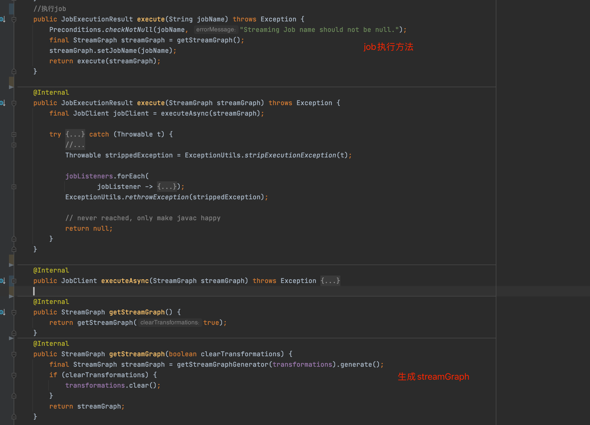

### 写在前面的话

旨在记录源码阅读过程，中间加入了AI美化的语句及自己的想法，如有疑问或错误请尽情留言讨论

​     在数据流处理领域，Apache Flink 作为一个高性能、低延迟的流处理引擎，以其强大的功能和灵活的架构而备受关注。然而，对于许多刚接触 Flink 的开发者来说，Flink Client 的角色往往不为人知。你是否曾经好奇，当你运行一个 Flink 脚本时，背后究竟发生了什么？Flink Client 又在其中扮演了什么样的重要角色？本文将带你深入探索 Flink Client，从脚本执行到 StreamGraph 和 JobGraph 的转变过程，为你揭开这一切的神秘面纱，文末附解析源码全过程

### 什么是Flink Client

Flink Client 是 Flink 生态系统中的一个关键组件，负责接收用户提交的作业，将其转换为 Flink 可执行的格式，并将其发送到集群进行执行。Flink Client 的主要功能包括：

- 解析用户编写的 Flink 程序。
- 生成程序的执行计划。
- 将执行计划提交给 JobManager 以启动作业。

Flink Client 是用户与 Flink 集群交互的桥梁，通过它，用户可以方便地提交和管理 Flink 作业。

###  从脚本到执行：Flink Client 的作用

当用户编写并运行一个 Flink 脚本时，Flink Client 扮演了关键角色。其具体流程如下：

1. **接收作业**：用户通过 CLI 或者 API 提交一个 Flink 作业。
2. **解析作业**：Flink Client 解析用户提交的代码，生成一个 StreamGraph。
3. **生成执行计划**：Flink Client 将 StreamGraph 转换为 JobGraph，这是一个更加详细的执行计划。
4. **提交作业**：Flink Client 将 JobGraph 提交给 Flink 集群中的 JobManager 以启动作业执行。

Flink Client 在整个过程中与 JobManager 密切配合，确保作业能够正确地解析、转换和执行。

### 从源码剖析 client的执行流程

基于Flink1.14，Standalone session模式，以flink自带wordcount为例

##### 中间对象

transformation -> streamNode、streamEdge、JobVertex

Transformation：是用户定义的数据流操作的抽象表示

StreamNode：是 `StreamGraph` 中的一个节点，表示一个逻辑操作。每个 `Transformation` 会被转换为一个或多个 `StreamNode`

streamEdge：`StreamEdge` 表示 `StreamNode` 之间的连接，描述了数据流动的路径。每条 `StreamEdge` 定义了数据在 `StreamNode` 之间的传输方式和分区策略。

JobVertex：`JobVertex` 是 Flink 执行计划（`JobGraph`）中的基本单位。每个 `JobVertex` 表示一个并行执行的任务，包含多个并行子任务。`JobVertex` 是从 `StreamNode` 转换而来的，是 Flink 提交给集群执行的具体计算单元。

###### 转换流程

1. 用户定义的 `Transformation` 被解析并生成 `StreamGraph`。

2. `StreamGraph` 包含多个 `StreamNode` 和 `StreamEdge`，描述逻辑数据流。

3. `StreamGraph` 被优化和转换为 `JobGraph`。

4. `JobGraph` 包含多个 `JobVertex` 和 `JobEdge`，描述物理执行计划。

5. `JobGraph` 提交给 Flink 集群执行，`JobVertex` 被调度为具体的并行任务在集群上运行。

#### 核心类及方法

```JAVA
org.apache.flink.client.cli.CliFrontend #客户端程序入口
  main(args) #入口方法
  	parseAndRun(args) #解析args的命令，启动对应action的方法
       run(String[] args)
  					.....
  				 			callMainMethod(Class<?> entryClass, String[] args) #通过反射来执行 wordCount
//执行WordCount时，内部会维护StreamExecutionEnvironment对象，StreamExecutionEnvironment内将所有算子操作转换为底层对应的transforms
  ....
 env.execute(jobName)
 org.apache.flink.streaming.api.environment.StreamExecutionEnvironment  #执行流程的上下文类
  execute(jobName)
    getStreamGraphGenerator(transformations).generate()  #transformations->streamGraph
    execute(streamGraph)
  			executeAsync(StreamGraph streamGraph)
         org.apache.flink.core.execution.PipelineExecutor ##接口类
         org.apache.flink.client.deployment.executors.AbstractSessionClusterExecutor ## session实现类
              execute(streamGraph, configuration, userClassloader)
  	                 PipelineExecutorUtils.getJobGraph(pipeline, configuration) ##pipeline即streamGraph
  														FlinkPipelineTranslationUtil.getJobGraph(pipeline, configuration,parallelism)
  																			getPipelineTranslator(pipeline) # 根据streamGraph获取对应translator
  																			org.apache.flink.streaming.api.graph.StreamingJobGraphGenerator
  																					createJobGraph()  ##将streamGraph 转换为jobGraph
                    clusterClient.submitJob(jobGraph)
```

###### main


###### parseAndRun


###### run


###### 将算子包内逻辑 加载为transformations(下方附all Tarnsformations )


###### execute(jobName) 将任务转换为streamGraph




###### 生成JobGraph


###### JobGraph提交


#### 中间结果图

###### StreamGraph


###### JobGraph


###### Transformation对应的子类图


`PartitionTransformation` 是 Flink 中用来修改数据分区方式的一种特殊操作。它并不直接在 `StreamExecutionEnvironment` 的 `transformations` 列表中记录，因为它主要是对数据流拓扑结构的修改，而不是具体的数据处理操作。

### 扩展

在 Apache Flink 中，`PartitionTransformation` 是一种特殊的操作，用于修改数据流的分区方式。它确实不会直接记录在 `StreamExecutionEnvironment` 的 `transformations` 列表中，因为它更关注于数据流的拓扑结构而非具体的数据处理操作。除了 `PartitionTransformation`，还有其他一些特殊的 `Transformation` 也不会直接记录在 `transformations` 列表中。让我们深入了解这些特殊的 `Transformation` 及其在 Flink 中的角色。

### 特殊的 Transformations

1. **PartitionTransformation**
   - **作用**：修改数据流的分区策略，例如 `rebalance`、`rescale`、`global` 等。
   - **不记录原因**：主要用于调整数据流的物理结构，而非数据处理逻辑。
2. **UnionTransformation**
   - **作用**：将多个数据流合并为一个数据流。
   - **不记录原因**：它是对多个流进行合并操作，形成一个新的数据流，不属于单一的逻辑处理操作。
3. **SideOutputTransformation**
   - **作用**：从主数据流中分离出侧输出流。
   - **不记录原因**：侧输出流是主数据流处理过程中产生的附加输出，属于数据流结构的调整。
4. **SplitTransformation**
   - **作用**：将数据流根据特定条件拆分为多个子流（已被 `SideOutputTransformation` 替代）。
   - **不记录原因**：主要用于生成多个子流，而不是单一的处理操作。
5. **FeedbackTransformation**
   - **作用**：用于处理反馈流（如迭代流）的特殊 `Transformation`。
   - **不记录原因**：反馈流在迭代计算中使用，不属于一般的处理操作。

### 为什么这些 Transformations 不记录在 Transformations 列表中

这些特殊的 `Transformation` 主要用于调整数据流的物理结构或管理数据流的拓扑，而不是具体的处理操作。`StreamExecutionEnvironment` 的 `transformations` 列表主要用于记录用户定义的处理逻辑操作，如 `map`、`filter`、`flatMap` 等。因此，这些特殊的 `Transformation` 不会直接记录在 `transformations` 列表中。

###### 客户端工厂类图

